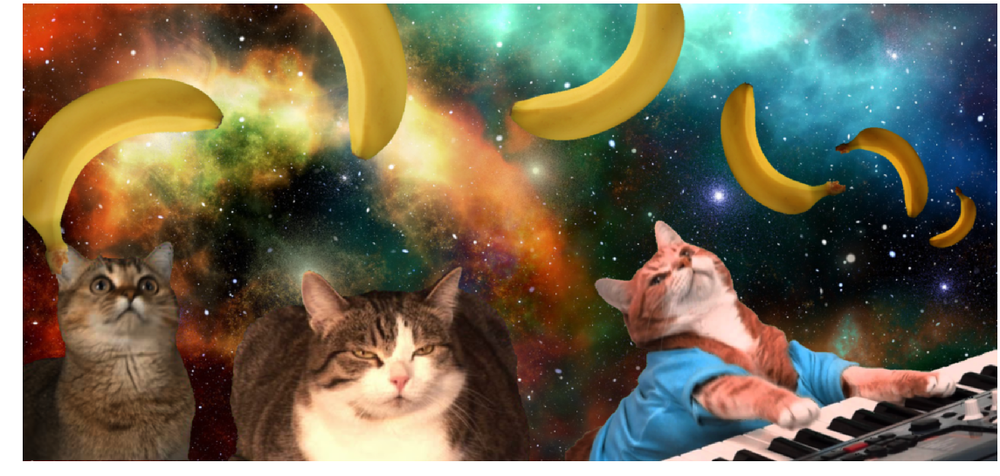

https://github.com/janarf/processamento-de-imagens1/blob/master/tp1/tp1.ipynb

# Trabalho 1: Processamento de Imagens Digitais

### DCC029: Processamento de Imagens Digitais
Conceitos de digitalização e representação de imagens. Elementos de um sistema de processamento digital de imagens. Técnicas de modificação da escala de cinza, técnicas de modificação por histograma, operações aritméticas com imagens, pseudocoloração, suavização de imagens, aguçamento de bordas, filtros espaciais.   

## Requisitos do Trabalho
O seu programa deverá cumprir os seguintes requisitos:
1. Carregar no mı́nimo 5 imagens
2. Aplicar a técnica de chroma key nas imagens (menos na de fundo)
3. Aplicar operações radiométricas, geométricas e de filtros nas imagens (no mı́nimo uma operação de
cada)
4. Combinar todas as imagens em uma só
5. Salvar e exibir a imagem resultante

https://github.com/janarf/processamento-de-imagens1/blob/master/TP1-ChromaKey.pdf

## Trabalho final

Notebook final:

https://github.com/janarf/processamento-de-imagens1/blob/master/tp1/tp1.ipynb

Imagem final:

